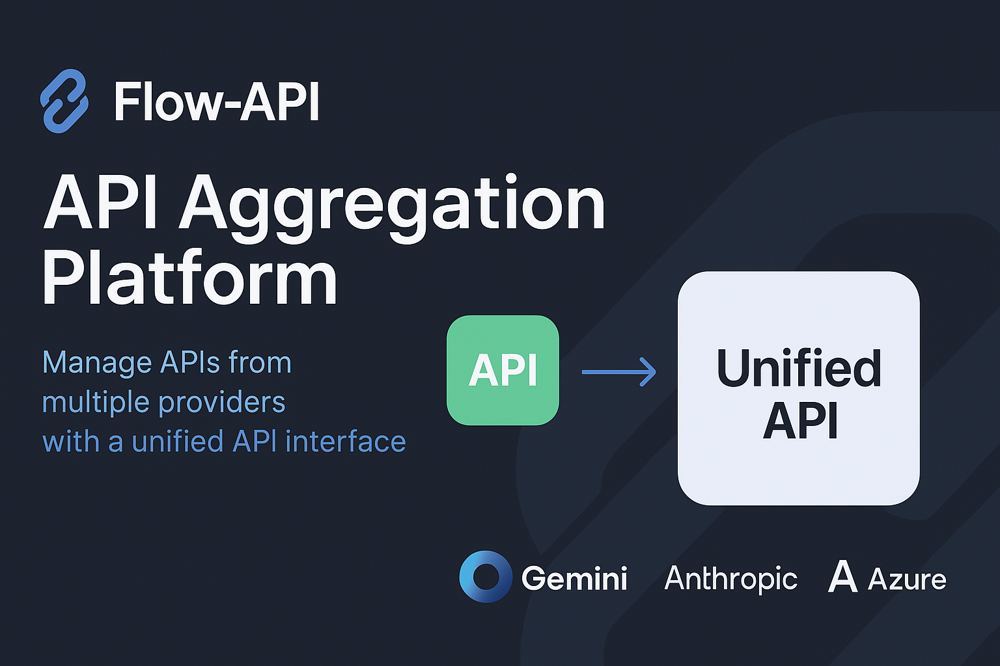

## [](https://opensource.org/licenses/MIT)

## 👋 Welcome to Flow-API!

Tired of juggling multiple API keys and navigating complex documentation for different services? Flow-API is here to streamline your workflow! We provide a powerful **API aggregation platform** that acts as a central hub for all your third-party API needs.

Imagine managing APIs for cloud storage, payment processing, AI models, and communication services – all through **one consistent interface** and **one set of credentials**. Flow-API makes this a reality, simplifying integration, reducing complexity, and saving you valuable development time.

Whether you're a solo developer, a startup, or a large enterprise, Flow-API empowers you to connect, manage, and monitor your essential services effortlessly.

## ✨ Key Features

*   🔑 **Unified API Access:** Say goodbye to provider-specific SDKs and authentication methods. Interact with diverse services (like OpenAI, Stripe, AWS S3, Twilio, etc. - *examples*) using a single, standardized Flow-API endpoint.
*   🔐 **Centralized Key Management:** Securely store and manage your API keys from various providers within your Flow-API account. No more scattering sensitive credentials across different projects or environments.
*   📊 **Intuitive Dashboard:** Get a clear overview of your connected services, monitor API call usage, track spending, and manage your account settings through a clean and modern web interface.
*   💰 **Wallet & Token System:** Manage your Flow-API balance, purchase credits (tokens), and monitor costs associated with your API usage across all connected services.
*   📚 **Integrated Documentation:** Access clear, concise documentation not only for the Flow-API platform itself but also for the specific endpoints of the integrated third-party services, all in one place.
*   👤 **Secure User Authentication:** Robust login and registration system to protect your account and API keys.
*   🔌 **Extensible Architecture:** Designed with future growth in mind, allowing for easy integration of new API providers.

## 🏗️ Project Structure

The Flow-API project is organized into two main components:

*   `./frontend`: The sleek and responsive user interface built with Next.js, allowing users to manage their accounts, keys, and services.
*   `./backend`: (Coming Soon!) The core engine built with Go. This service will handle the actual API request routing, authentication with third-party providers, data persistence, and the main business logic.

## 💻 Technology Stack

### Frontend (Current)

*   **Framework:** [Next.js](https://nextjs.org/) (v15+ with Turbopack) - _For a fast, modern web experience._
*   **Language:** [TypeScript](https://www.typescriptlang.org/) - _For robust, type-safe code._
*   **UI Library:** [React](https://reactjs.org/) (v19) - _The foundation for our interactive components._
*   **Styling:** [Tailwind CSS](https://tailwindcss.com/) (v4) - _Utility-first CSS for rapid UI development._
*   **Components:** [Radix UI](https://www.radix-ui.com/) Primitives & [shadcn/ui](https://ui.shadcn.com/) style - _Accessible, unstyled components brought to life._
*   **State Management:** [Zustand](https://zustand-demo.pmnd.rs/) - _Simple, lightweight state management._
*   **Icons:** [Lucide React](https://lucide.dev/) - _Beautiful and consistent icons._
*   **Theming:** [next-themes](https://github.com/pacocoursey/next-themes) - _Seamless light/dark mode switching._

### Backend (Planned)

*   **Language:** [Go (Golang)](https://golang.org/) - _Chosen for its performance, concurrency, and strong standard library, ideal for building scalable backend services._
*   _(Specific libraries/frameworks TBD)_

## 🚀 Getting Started (Frontend)

Want to run the frontend locally? Follow these steps:

1.  **Prerequisites:** Make sure you have [Node.js](https://nodejs.org/) (v20 or newer is recommended) and npm installed on your system.
2.  **Clone the Repository:**
    
    ```bash
    git clone https://github.com/Luorivergoddess/Flow-API.git
    cd Flow-API
    ```
3.  **Navigate to the Frontend Directory:**
    ```bash
    cd frontend
    ```
4.  **Install Dependencies:** Let npm fetch all the necessary packages.
    ```bash
    npm install
    ```
5.  **Run the Development Server:** Start the Next.js app in development mode (with Turbopack for speed!).
    ```bash
    npm run dev
    ```
6.  **Open Your Browser:** Navigate to [http://localhost:3000](http://localhost:3000). You should see the Flow-API frontend running!

## 🛠️ Backend Development

The Go backend is currently under active development. Setup instructions and details will be added here once the initial version is ready. Stay tuned!

## 🤝 Contributing (Optional)

We welcome contributions! If you'd like to help improve Flow-API, please check out our `CONTRIBUTING.md` guide (link to be added) for details on how to submit pull requests, report issues, and suggest features.

## 📄 License (Optional)

This project is licensed under the MIT License. See the [LICENSE](LICENSE) file for details. (You'll need to create a LICENSE file if you choose this).
